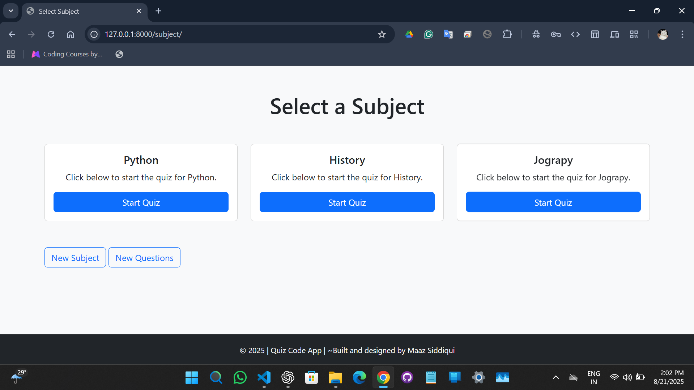
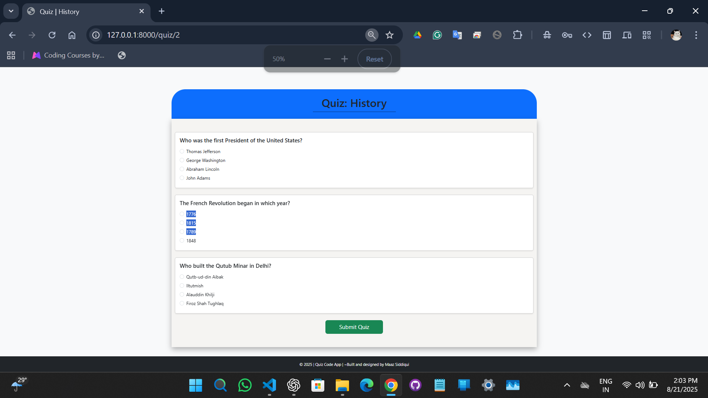
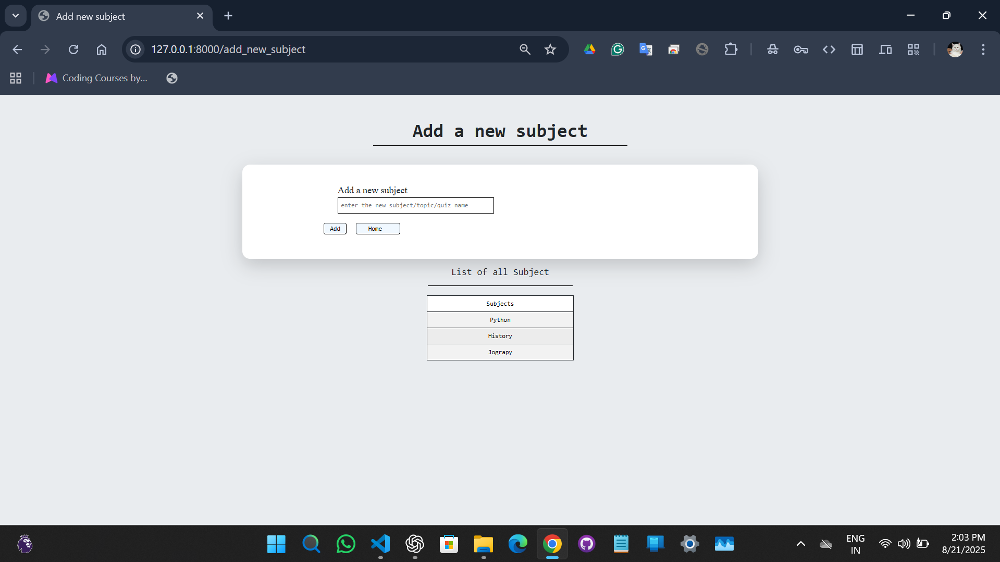
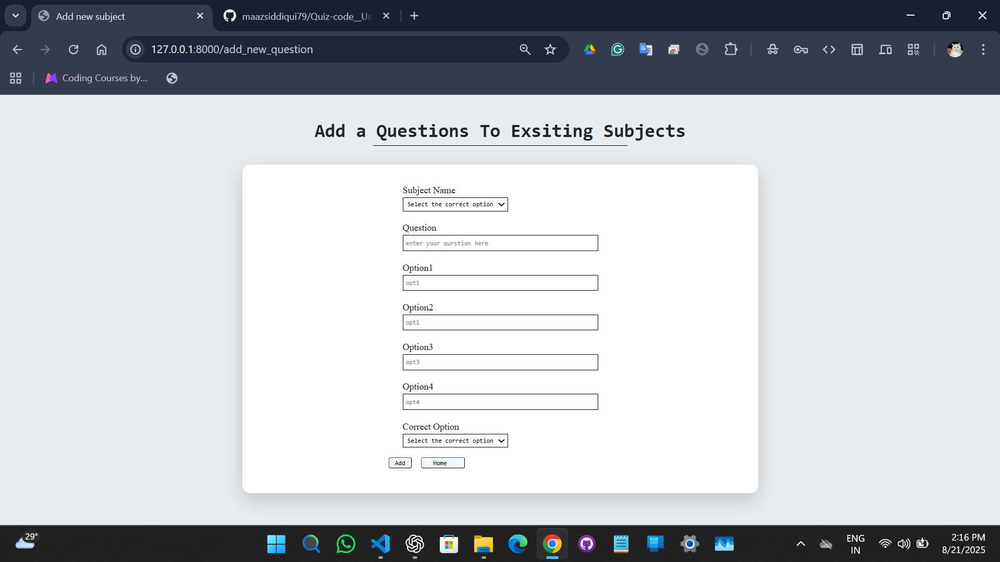

# 📝 Quiz Code App

A **Django-based Quiz Web Application** that allows users to create quiz subjects, add multiple-choice questions, and take quizzes in a clean and interactive way.  
This project was built as a personal learning project to understand **Django, Bootstrap, and dynamic quiz creation**.

---

## 🌟 Overview

The Quiz Code App is designed to let users practice and test their knowledge across different subjects.  
It provides flexibility to **create custom subjects and add questions** dynamically, making it suitable for both learners and educators.

The app flow is simple yet effective:

1. **Homepage** → Welcome screen.
2. **Subject Page** → Select a subject or create a new one.
3. **Quiz Page** → Attempt multiple-choice questions.
4. **Add New Subject Page** → Expand the quiz library by adding more subjects.

---

## 🚀 Features

✅ **Subject Management**

- Create new quiz subjects dynamically.
- View list of available subjects.

✅ **Quiz Creation**

- Add multiple-choice questions under a subject.
- Store correct answers for evaluation.

✅ **Quiz Attempt**

- User selects a subject and takes the quiz.
- Multiple-choice format for easy interaction.
- Submit button evaluates answers.

✅ **Responsive Design**

- Built using **Bootstrap** to ensure a smooth UI across desktop and mobile.

✅ **Scalable**

- New subjects and questions can be added without changing the code.

---

## 🛠️ Technologies Used

- **Django** → Backend framework for handling subjects, quizzes, and database.
- **Bootstrap** → Styling, layout, and responsiveness.
- **HTML5 / CSS3** → Structure and UI design.
- **Python** → Server-side logic and quiz functionality.
- **SQLite (default)** → Database for storing subjects & questions (can be switched to PostgreSQL/MySQL).

---

## ⚡ Installation & Setup

Follow the steps below to run the project locally:

```bash
# 1. Clone the repository
git clone https://github.com/maazsiddiqui79/Quiz-code__Using-Django.git

cd quiz-code-app

# 2. Create virtual environment (recommended)
python -m venv venv
source venv/bin/activate   # On Linux/Mac
venv\Scripts\activate      # On Windows

# 3. Install dependencies
pip install django

# 4. Run database migrations
python manage.py migrate

# 5. Start the development server
python manage.py runserver
```

Now open **[http://127.0.0.1:8000/](http://127.0.0.1:8000/)** in your browser. 🎉

---

## 🎯 Usage

1. **Visit Homepage** → Introduction screen with a “Take Quiz” button.
2. **Select Subject** → Choose an existing subject or create a new one.
3. **Start Quiz** → Answer multiple-choice questions and submit.
4. **Add New Subject** → Use the input form to add new topics.
5. **Add Questions** → Expand the question set for better practice.

This makes the app **adaptable for schools, personal learning, or training purposes.**

---

## 📸 Screenshots

### 🏠 Homepage

Welcome page of the Quiz App where users can start their quiz journey.


---

### 📚 Select Subject

Choose the subject you want to attempt from the available list.


---

### 📝 Take Quiz

Example of a quiz interface with multiple-choice questions.


---

### ➕ Add New Subject

Easily add new subjects to expand your quiz collection.


---

### ➕ Add New Questions

Easily add new question to expand your quiz.


---

## 📌 Roadmap

- Add quiz results & scoring system.
- Leaderboard for competitive quizzes.
- Timed quizzes for better practice.
- Option to edit/delete subjects and questions.

---

## 👨‍💻 Author

**Developed by:** _Maaz Irshad Siddiqui_

- 🌐 **Portfolio:** [the-maaz-portfolio.com](https://the-maaz-portfolio.vercel.app)
- 💼 **LinkedIn:** [linkedin/siddiqui-maazzz.com](https://www.linkedin.com/in/siddiqui-maazzz/)
- 📞 **Contact:** +91 8850281310

---

_~Code Every Day, Grow Every Day✨_
